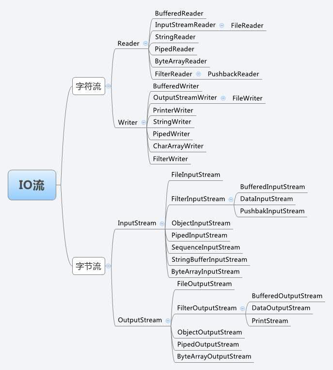

**BIO（Blocking IO）**：同步阻塞IO，一个请求的数据的读取或写入必须阻塞在一个线程上等待其完成。Java1.4之前，都是BIO通信模式，而我们常见字节流和字符流也都是BIO。

在使用BIO进行网络通信时，首先server启动一个ServerSocket，然后client启动Socket来对服务端进行通信，默认情况下服务端需要建立一堆线程等待请求，而客户端发送请求后，先询问服务端是否有线程响应，如果没有则会一直等待或者遭到拒绝请求。